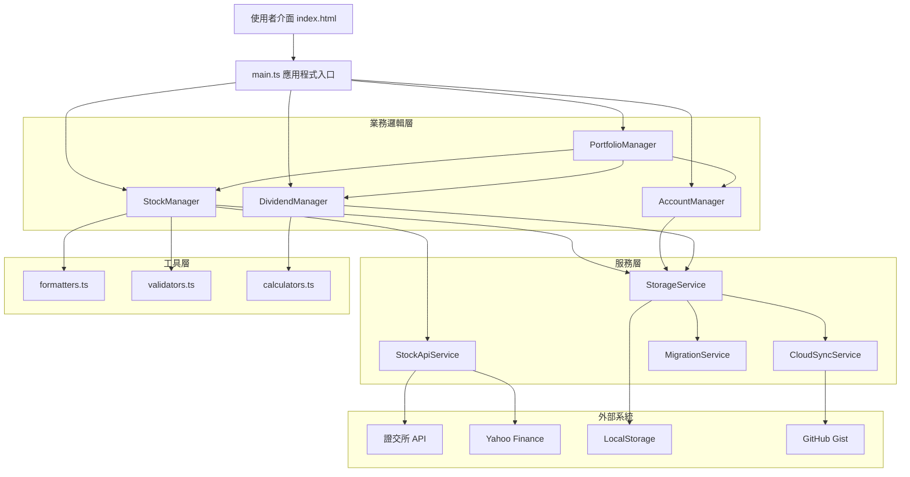

# v1.3.X 架構升級設計文件

## 概述

v1.3.X 是存股紀錄系統的重大架構升級，採用 TypeScript、模組化設計和完整測試覆蓋。本設計遵循 SOLID 原則，將系統拆分為清晰的層次：Manager（業務邏輯）、Service（外部服務）、Utils（工具函數），並確保與 v1.2.X 完全隔離。

### 設計目標

1. **可維護性**：模組化設計，單一職責原則
2. **可測試性**：依賴注入，完整的單元測試和屬性測試
3. **型別安全**：TypeScript 提供編譯時型別檢查
4. **版本隔離**：與 v1.2.X 完全獨立，支援資料遷移
5. **效能優化**：批次處理、虛擬滾動、快取機制

## 技術棧

### 🏗️ 核心技術架構

#### 程式語言與框架
- **TypeScript 5.0+** - 型別安全的 JavaScript 超集
  - 嚴格模式啟用 (`strict: true`)
  - ES2022 目標編譯
  - 完整的型別定義覆蓋
- **ES2022 模組系統** - 現代 JavaScript 模組化
  - ESM 模組格式 (`"type": "module"`)
  - 動態 import 支援
  - Tree-shaking 優化

#### 建置工具鏈
- **Vite 5.0** - 快速建置工具和開發伺服器
  - esbuild 編譯器（比 Webpack 快 10-100 倍）
  - 熱模組替換 (HMR)
  - 程式碼分割和懶載入
- **ESBuild** - 超快速 JavaScript/TypeScript 編譯器
  - 程式碼最小化
  - Source map 生成
  - 瀏覽器相容性轉換

#### 開發工具
- **ESLint 8.45+** - 程式碼品質檢查
  - TypeScript 規則集
  - Prettier 整合
  - 自動修復功能
- **Prettier 3.0+** - 程式碼格式化
  - 統一程式碼風格
  - 自動格式化
- **Jest 29.5+** - 單元測試框架
  - TypeScript 支援 (ts-jest)
  - JSDOM 環境模擬
  - 測試覆蓋率報告
- **fast-check 3.15+** - 屬性測試框架
  - 隨機測試資料生成
  - 邊界條件測試

### 🌐 前端技術

#### 使用者介面
- **原生 HTML5** - 語義化標記
  - 無框架依賴
  - 輕量化實作
  - 快速載入
- **現代 CSS3** - 樣式設計
  - CSS Grid 佈局
  - Flexbox 排版
  - CSS 變數 (Custom Properties)
  - 響應式設計 (RWD)
- **原生 JavaScript** - 互動邏輯
  - DOM 操作
  - 事件處理
  - 非同步程式設計

#### 瀏覽器相容性
```json
"browserslist": [
  "Chrome >= 80",
  "Firefox >= 78", 
  "Safari >= 14",
  "Edge >= 80"
]
```

### 📦 依賴管理

#### 運行時依賴
- **xlsx 0.18.5** - Excel 檔案處理
  - 匯入/匯出功能
  - 多種格式支援

#### 開發依賴
- **@types/jest** - Jest 型別定義
- **@typescript-eslint/** - TypeScript ESLint 規則
- **ts-jest** - Jest TypeScript 支援

### 🗄️ 資料儲存

#### 客戶端儲存
- **LocalStorage** - 主要資料儲存
  - 版本隔離 (`stockPortfolio_v1.3`)
  - JSON 序列化
  - 配額管理
- **SessionStorage** - 暫存資料
  - 使用者偏好設定
  - 快取資料

#### 資料格式
- **JSON** - 資料交換格式
- **TypeScript 介面** - 型別定義
- **版本化資料結構** - 向後相容

### 🌍 部署與託管

#### GitHub Pages 配置
- **靜態網站託管** - 無伺服器架構
- **相對路徑配置** - `base: './'`
- **自動部署** - GitHub Actions 整合

#### 建置輸出
```typescript
build: {
  outDir: 'dist',
  sourcemap: true,
  minify: 'esbuild',
  
  // 程式碼分割
  rollupOptions: {
    output: {
      manualChunks: {
        'vendor': ['xlsx'],
        'managers': ['./src/managers/*'],
        'services': ['./src/services/*'],
      }
    }
  }
}
```

### 📡 API 整合

#### 股價資料來源
1. **Yahoo Finance API** - 主要資料源
   - 即時股價查詢
   - 股票基本資訊
   - CORS 代理解決方案
2. **證交所 API (TWSE/TPEx)** - 備援資料源
   - 台股官方資料
   - 上市/上櫃/興櫃支援
3. **本地資料庫** - 名稱對照
   - 中文名稱對照表
   - 股票類型分類

#### CORS 解決方案
```typescript
// 使用 CORS 代理服務
const corsProxy = 'https://api.allorigins.win/raw?url=';
const yahooUrl = `https://query1.finance.yahoo.com/v8/finance/chart/${symbol}`;

const response = await fetch(
  corsProxy + encodeURIComponent(yahooUrl)
);
```

### 🔧 開發環境

#### Node.js 環境
- **Node.js >= 18.0.0** - JavaScript 運行環境
- **npm >= 9.0.0** - 套件管理器

#### 開發伺服器
```typescript
server: {
  port: 3000,
  open: true,
  cors: true,
  host: true, // 允許外部訪問
}
```

### 🏛️ 架構模式

#### 模組化架構
- **Manager 層** - 業務邏輯
  - StockManager, AccountManager, DividendManager, PortfolioManager
- **Service 層** - 外部服務
  - StockApiService, StorageService, MigrationService
- **Utils 層** - 工具函數
  - formatters, validators, calculators

#### 設計模式
- **依賴注入** - 鬆耦合設計
- **單一職責原則** - 每個類別專注單一功能
- **策略模式** - API 查詢策略
- **觀察者模式** - 事件處理

### 🔒 安全性與效能

#### 安全性措施
- **型別安全** - TypeScript 編譯時檢查
- **輸入驗證** - 資料驗證器
- **錯誤處理** - 完整的例外處理
- **資料隱私** - 客戶端儲存，無伺服器傳輸

#### 效能優化
- **程式碼分割** - 按需載入
- **快取機制** - API 回應快取 (1分鐘 TTL)
- **批次處理** - 股價更新批次化
- **防抖動** - 使用者輸入防抖

### 📊 監控與除錯

#### 開發工具
- **Source Maps** - 除錯支援
- **TypeScript 診斷** - 即時錯誤檢查
- **Console 日誌** - 詳細執行記錄
- **版本資訊** - 完整版本追蹤

#### 測試策略
- **單元測試** - Jest 框架
- **屬性測試** - fast-check 隨機測試
- **整合測試** - API 整合測試
- **手動測試** - 使用者介面測試

## 架構

### 系統架構圖



### 層次職責

#### 1. Manager 層（業務邏輯）
- **StockManager**: 管理股票的 CRUD 操作、股價更新
- **AccountManager**: 管理帳戶的建立、刪除、切換
- **DividendManager**: 管理股息記錄、計算調整成本價
- **PortfolioManager**: 協調各 Manager，計算投資組合統計

#### 2. Service 層（外部服務）
- **StockApiService**: 封裝股價 API 呼叫邏輯
- **StorageService**: 封裝 LocalStorage 操作
- **CloudSyncService**: 處理 GitHub Gist 同步
- **MigrationService**: 處理 v1.2 到 v1.3 的資料遷移

#### 3. Utils 層（工具函數）
- **formatters**: 格式化金額、日期、百分比
- **validators**: 驗證股票代碼、金額、日期
- **calculators**: 計算損益、報酬率、殖利率

## 元件與介面

### 核心型別定義

```typescript
// src/types/Stock.ts
export interface Stock {
  id: string;
  code: string;
  name: string;
  shares: number;
  costPrice: number;
  currentPrice: number;
  purchaseDate: string;
  accountId: string;
  lastUpdated: string;
  dataSource: 'TWSE' | 'Yahoo' | 'Local';
}

// src/types/Account.ts
export interface Account {
  id: string;
  name: string;
  createdAt: string;
}

// src/types/Dividend.ts
export interface Dividend {
  id: string;
  stockId: string;
  exDividendDate: string;
  dividendPerShare: number;
  totalDividend: number;
  createdAt: string;
}

// src/types/Portfolio.ts
export interface PortfolioStats {
  totalValue: number;
  totalCost: number;
  totalGain: number;
  totalGainPercent: number;
  totalDividend: number;
  totalReturn: number;
  totalReturnPercent: number;
}
```

### StockManager

```typescript
// src/managers/StockManager.ts
export class StockManager {
  private stocks: Map<string, Stock> = new Map();
  
  constructor(
    private apiService: StockApiService,
    private storageService: StorageService
  ) {}
  
  async addStock(stockData: Omit<Stock, 'id' | 'lastUpdated'>): Promise<Stock> {
    // 驗證股票代碼
    // 查詢股票名稱（如果未提供）
    // 建立股票記錄
    // 儲存到 storage
    // 回傳新股票
  }
  
  async updateStockPrice(stockId: string): Promise<void> {
    // 從 API 取得最新股價
    // 更新股票記錄
    // 儲存變更
  }
  
  async updateAllPrices(): Promise<void> {
    // 批次更新所有股票股價
    // 使用 Promise.allSettled 處理部分失敗
  }
  
  deleteStock(stockId: string): void {
    // 刪除股票記錄
    // 刪除相關股息記錄
    // 儲存變更
  }
  
  getStocksByAccount(accountId: string): Stock[] {
    // 回傳指定帳戶的所有股票
  }
  
  getAllStocks(): Stock[] {
    // 回傳所有股票
  }
}
```

### StockApiService

**重要規則：股價查詢順序**

股價查詢必須嚴格遵循以下順序，**絕對不可更改**：

1. **證交所 API (TWSE/TPEx)** - 最高優先級
   - 提供最準確的台股即時資料
   - 支援上市、上櫃、興櫃、ETF
   
2. **Yahoo Finance API** - 次優先級
   - 作為證交所 API 的備援
   - 支援國際股票查詢
   - **優先使用本地資料庫的中文名稱**（如果有）
   
3. **拋出錯誤** - 所有 API 都失敗時

**新增個股查詢規則（searchStockByCode）**：

新增個股時的股票資訊查詢必須遵循以下順序：

1. **Yahoo Finance API** - 最高優先級
   - 可返回完整的股票名稱和價格
   - 支援所有台股查詢
   
2. **證交所 API (TWSE/TPEx)** - 次優先級
   - 作為 Yahoo API 的備援
   - 查詢成功後，可使用本地資料庫的中文名稱（僅用於顯示）
   
3. **拋出錯誤** - 所有 API 都失敗時
   - **絕對不使用本地資料庫作為查詢來源**

**禁止事項**：
- ❌ 禁止優先使用本地資料庫
- ❌ 禁止跳過證交所 API 直接使用其他方法
- ❌ 禁止改變搜尋順序
- ❌ 禁止因為速度考量而違反順序
- ❌ 禁止使用本地資料庫查詢股價
- ❌ **禁止在新增個股時使用本地資料庫作為查詢來源**

**本地資料庫的唯一用途**：
- ✅ 提供股票代碼與中文名稱的對照
- ✅ 當 API 返回英文名稱時，替換為中文名稱
- ✅ **僅在證交所 API 查詢成功後，用於提供中文名稱**
- ❌ **不可在新增個股時作為獨立的查詢來源**

```typescript
// src/services/StockApiService.ts
export class StockApiService {
  private cache: Map<string, CachedPrice> = new Map();
  private readonly CACHE_TTL = 60000; // 1 分鐘
  
  async getStockPrice(code: string): Promise<StockPriceResult> {
    // 檢查快取
    if (this.isCacheValid(code)) {
      return this.cache.get(code)!.data;
    }
    
    // 1. 嘗試證交所 API（最高優先級）
    try {
      const price = await this.fetchFromTWSE(code);
      this.updateCache(code, price);
      return { price, source: 'TWSE' };
    } catch (error) {
      console.warn('TWSE API failed:', error);
    }
    
    // 2. 嘗試 Yahoo Finance（次優先級）
    try {
      const price = await this.fetchFromYahoo(code);
      this.updateCache(code, price);
      return { price, source: 'Yahoo' };
    } catch (error) {
      console.warn('Yahoo API failed:', error);
    }
    
    // 3. 所有 API 都失敗，拋出錯誤
    // 注意：不使用本地資料庫查詢股價
    throw new Error(`無法取得股票 ${code} 的價格，所有 API 都失敗`);
  }
  
  async searchStockByCode(code: string): Promise<StockInfo> {
    // 1. 嘗試 Yahoo Finance API（最高優先級）
    // 可返回完整股票名稱，優先使用本地資料庫的中文名稱
    try {
      const yahooInfo = await this.fetchStockInfoFromYahoo(code);
      // 優先使用本地資料庫的中文名稱
      const localInfo = this.getStockInfoFromLocalDB(code);
      if (localInfo) {
        yahooInfo.name = localInfo.name;
        yahooInfo.type = localInfo.type;
      }
      return yahooInfo;
    } catch (error) {
      console.warn('Yahoo API failed:', error);
    }
    
    // 2. 嘗試證交所 API（次優先級）
    try {
      const price = await this.fetchFromTWSE(code);
      // 使用本地資料庫的中文名稱（如果有）
      const localInfo = this.getStockInfoFromLocalDB(code);
      return {
        code,
        name: localInfo?.name || code,
        price,
        type: localInfo?.type,
        source: 'TWSE'
      };
    } catch (error) {
      console.warn('TWSE API failed:', error);
    }
    
    // 3. 嘗試本地資料庫（最低優先級）
    // 僅提供名稱，不提供股價
    const localInfo = this.getStockInfoFromLocalDB(code);
    if (localInfo) {
      return {
        code: localInfo.code,
        name: localInfo.name,
        type: localInfo.type,
        source: 'Local',
        // 注意：不提供 price 欄位
      };
    }
    
    // 4. 所有方法都失敗
    throw new Error(`無法找到股票 ${code} 的資訊`);
  }
  
  private async fetchFromTWSE(code: string): Promise<number> {
    // 實作證交所 API 呼叫
  }
  
  private async fetchFromYahoo(code: string): Promise<number> {
    // 實作 Yahoo Finance API 呼叫
  }
  
  private async fetchStockInfoFromYahoo(code: string): Promise<StockInfo> {
    // 實作 Yahoo Finance API 呼叫，返回完整資訊
    // 包含股票代碼、名稱、價格
  }
  
  private getStockInfoFromLocalDB(code: string): LocalStockEntry | null {
    // 從本地資料庫查詢股票名稱
    // 注意：僅返回名稱和類型，不返回價格
  }
}
```

### StorageService

```typescript
// src/services/StorageService.ts
export class StorageService {
  private readonly STORAGE_KEY = 'stockPortfolio_v1.3';
  
  save(data: PortfolioData): void {
    try {
      const json = JSON.stringify(data);
      localStorage.setItem(this.STORAGE_KEY, json);
    } catch (error) {
      if (error.name === 'QuotaExceededError') {
        throw new Error('儲存空間不足');
      }
      throw error;
    }
  }
  
  load(): PortfolioData | null {
    const json = localStorage.getItem(this.STORAGE_KEY);
    if (!json) return null;
    
    try {
      return JSON.parse(json);
    } catch (error) {
      console.error('資料解析失敗:', error);
      return null;
    }
  }
  
  clear(): void {
    localStorage.removeItem(this.STORAGE_KEY);
  }
  
  hasData(): boolean {
    return localStorage.getItem(this.STORAGE_KEY) !== null;
  }
}
```

### MigrationService

```typescript
// src/services/MigrationService.ts
export class MigrationService {
  private readonly OLD_STORAGE_KEY = 'stockPortfolio_v1.2';
  private readonly NEW_STORAGE_KEY = 'stockPortfolio_v1.3';
  
  hasOldData(): boolean {
    return localStorage.getItem(this.OLD_STORAGE_KEY) !== null;
  }
  
  hasNewData(): boolean {
    return localStorage.getItem(this.NEW_STORAGE_KEY) !== null;
  }
  
  shouldPromptMigration(): boolean {
    return this.hasOldData() && !this.hasNewData();
  }
  
  migrate(): MigrationResult {
    try {
      // 1. 讀取舊版資料
      const oldData = this.loadOldData();
      if (!oldData) {
        throw new Error('無法讀取舊版資料');
      }
      
      // 2. 轉換資料格式
      const newData = this.transformData(oldData);
      
      // 3. 驗證轉換結果
      this.validateNewData(newData);
      
      // 4. 儲存到新版
      localStorage.setItem(this.NEW_STORAGE_KEY, JSON.stringify(newData));
      
      // 5. 保留舊版資料（不刪除）
      
      return {
        success: true,
        migratedStocks: newData.stocks.length,
        migratedAccounts: newData.accounts.length
      };
    } catch (error) {
      return {
        success: false,
        error: error.message
      };
    }
  }
  
  private transformData(oldData: any): PortfolioData {
    // 轉換資料結構
    // 處理欄位名稱變更
    // 添加新欄位的預設值
    // 移除已廢棄的欄位
  }
}
```

## 資料模型

### 資料庫結構（LocalStorage）

```typescript
interface PortfolioData {
  version: string;  // "1.3.0"
  accounts: Account[];
  stocks: Stock[];
  dividends: Dividend[];
  settings: {
    privacyMode: boolean;
    darkMode: boolean;
    autoUpdate: boolean;
    updateInterval: number;
    cloudSync: {
      enabled: boolean;
      token?: string;
      gistId?: string;
      lastSync?: string;
    };
  };
  metadata: {
    createdAt: string;
    lastModified: string;
    migratedFrom?: string;  // "1.2.2.0025"
  };
}
```

### 資料遷移對照表

| v1.2.X 欄位 | v1.3.X 欄位 | 轉換邏輯 |
|------------|------------|---------|
| `stockCode` | `code` | 直接複製 |
| `stockName` | `name` | 直接複製 |
| `quantity` | `shares` | 直接複製 |
| `buyPrice` | `costPrice` | 直接複製 |
| `currentPrice` | `currentPrice` | 直接複製 |
| `buyDate` | `purchaseDate` | 格式轉換 ISO 8601 |
| `account` | `accountId` | 產生 UUID |
| - | `id` | 產生新 UUID |
| - | `lastUpdated` | 設為遷移時間 |
| - | `dataSource` | 預設 'Local' |

## 錯誤處理

### 錯誤類型定義

```typescript
// src/types/Errors.ts
export class StockError extends Error {
  constructor(
    message: string,
    public code: string,
    public details?: any
  ) {
    super(message);
    this.name = 'StockError';
  }
}

export class ApiError extends StockError {
  constructor(message: string, public statusCode?: number) {
    super(message, 'API_ERROR');
    this.name = 'ApiError';
  }
}

export class ValidationError extends StockError {
  constructor(message: string, public field: string) {
    super(message, 'VALIDATION_ERROR');
    this.name = 'ValidationError';
  }
}

export class StorageError extends StockError {
  constructor(message: string) {
    super(message, 'STORAGE_ERROR');
    this.name = 'StorageError';
  }
}
```

### 錯誤處理策略

1. **API 錯誤**：
   - 自動重試（最多 3 次）
   - 降級到備用 API
   - 使用快取資料
   - 記錄錯誤但不中斷使用者操作

2. **儲存錯誤**：
   - 檢測空間不足，提示清理
   - 提供匯出備份選項
   - 嘗試雲端同步

3. **驗證錯誤**：
   - 即時顯示錯誤訊息
   - 標示錯誤欄位
   - 提供修正建議

4. **遷移錯誤**：
   - 回滾變更
   - 保留舊版資料
   - 提供手動匯入選項

## 測試策略

### 測試框架與工具

- **單元測試**: Jest + TypeScript
- **屬性測試**: fast-check (JavaScript 的 QuickCheck 實作)
- **覆蓋率目標**: 80% 以上
- **測試執行**: `npm test`
- **覆蓋率報告**: `npm run test:coverage`

### 測試組織

```
tests/
├── managers/
│   ├── StockManager.test.ts
│   ├── AccountManager.test.ts
│   └── DividendManager.test.ts
├── services/
│   ├── StockApiService.test.ts
│   ├── StorageService.test.ts
│   └── MigrationService.test.ts
├── utils/
│   ├── formatters.test.ts
│   ├── validators.test.ts
│   └── calculators.test.ts
├── fixtures/
│   ├── stocks.json
│   ├── accounts.json
│   └── v1.2-data.json
└── setup.ts
```

### 單元測試策略

- 每個 Manager 和 Service 都有對應的測試檔案
- 使用 Jest mock 模擬外部依賴
- 測試正常流程和錯誤情況
- 測試邊界條件（空陣列、null、undefined）

### 屬性測試策略

- 使用 fast-check 產生隨機測試資料
- 每個屬性測試至少執行 100 次迭代
- 測試通用屬性而非特定範例
- 每個測試標註對應的設計文件屬性編號

### 測試標註格式

```typescript
/**
 * Feature: v1.3-architecture-upgrade, Property 1: 資料遷移保留所有股票
 */
test('property: migration preserves all stocks', () => {
  fc.assert(
    fc.property(fc.array(stockGenerator()), (stocks) => {
      // 測試邏輯
    }),
    { numRuns: 100 }
  );
});
```


## 正確性屬性

*A property is a characteristic or behavior that should hold true across all valid executions of a system-essentially, a formal statement about what the system should do. Properties serve as the bridge between human-readable specifications and machine-verifiable correctness guarantees.*

基於需求分析，以下是 v1.3.X 架構升級的可測試正確性屬性：

### Property 1: 版本資料完全隔離
*對於任何* 儲存操作，v1.3.X 系統應該只讀寫 `stockPortfolio_v1.3` 鍵值，而 v1.2.X 系統應該只讀寫 `stockPortfolio_v1.2` 鍵值，兩者的操作不應互相影響。
**Validates: Requirements 1.5**

### Property 2: 工具函數無副作用（冪等性）
*對於任何* 工具函數和相同的輸入參數，多次呼叫應該產生相同的結果，且不應修改輸入參數或全域狀態。
**Validates: Requirements 3.3**

### Property 3: 資料遷移保留所有股票
*對於任何* 有效的 v1.2.X 資料，遷移到 v1.3.X 後，新版資料中的股票數量應該等於舊版資料中的股票數量，且每支股票的核心資訊（代碼、名稱、持股數、成本價）應該保持一致。
**Validates: Requirements 4.3**

### Property 4: 遷移保留舊版資料
*對於任何* 成功的資料遷移操作，舊版的 `stockPortfolio_v1.2` 鍵值應該仍然存在於 LocalStorage 中，且內容不應被修改。
**Validates: Requirements 4.4**

### Property 5: 遷移失敗時回滾
*對於任何* 導致錯誤的遷移操作，新版的 `stockPortfolio_v1.3` 鍵值應該不存在或保持遷移前的狀態，確保不會產生部分遷移的損壞資料。
**Validates: Requirements 4.5**

### Property 6: API 搜尋順序強制執行
*對於任何* 股票代碼查詢，系統必須嚴格遵循以下順序：
1. 首先嘗試證交所 API (TWSE/TPEx)
2. 證交所 API 失敗時，才嘗試 Yahoo Finance API
3. 所有 API 都失敗時，才使用本地資料庫（僅提供名稱，不提供股價）
4. 本地資料庫也沒有資料時，才拋出錯誤

**重要限制**：
- 本地資料庫**絕對不可**用於查詢股價
- 本地資料庫**僅用於**提供股票中文名稱對照
- 不可跳過任何 API 直接使用本地資料庫
- 不可因為速度考量而改變搜尋順序

**Validates: Requirements 7.3**

### Property 7: 錯誤日誌完整性
*對於任何* 系統錯誤，記錄的日誌物件應該包含時間戳記（timestamp）、錯誤類型（type）、錯誤訊息（message）和堆疊追蹤（stack）欄位。
**Validates: Requirements 8.2**

### Property 8: 並發請求限制
*對於任何* 批次股價更新操作，同時進行的 API 請求數量不應該超過設定的並發限制（例如 5 個），以避免 API 限流。
**Validates: Requirements 9.2**

### 測試實作指引

每個正確性屬性都應該實作為獨立的屬性測試，使用 fast-check 產生隨機測試資料：

```typescript
// 範例：Property 3 的實作
import fc from 'fast-check';

/**
 * Feature: v1.3-architecture-upgrade, Property 3: 資料遷移保留所有股票
 */
describe('MigrationService Property Tests', () => {
  test('property: migration preserves all stocks', () => {
    fc.assert(
      fc.property(
        fc.array(v12StockGenerator(), { minLength: 1, maxLength: 50 }),
        (v12Stocks) => {
          // 建立舊版資料
          const v12Data = { stocks: v12Stocks, accounts: [], dividends: [] };
          
          // 執行遷移
          const migrationService = new MigrationService();
          const v13Data = migrationService.transformData(v12Data);
          
          // 驗證股票數量相同
          expect(v13Data.stocks.length).toBe(v12Stocks.length);
          
          // 驗證每支股票的核心資訊
          v12Stocks.forEach((v12Stock, index) => {
            const v13Stock = v13Data.stocks.find(s => s.code === v12Stock.stockCode);
            expect(v13Stock).toBeDefined();
            expect(v13Stock.name).toBe(v12Stock.stockName);
            expect(v13Stock.shares).toBe(v12Stock.quantity);
            expect(v13Stock.costPrice).toBe(v12Stock.buyPrice);
          });
        }
      ),
      { numRuns: 100 }
    );
  });
});
```

## 建置與部署

### 開發環境設定

```bash
# 安裝依賴
npm install

# 開發模式（熱重載）
npm run dev

# 執行測試
npm test

# 執行測試並顯示覆蓋率
npm run test:coverage

# 型別檢查
npm run type-check

# Lint 檢查
npm run lint

# 格式化代碼
npm run format
```

### 建置流程

```bash
# 建置生產版本
npm run build

# 輸出目錄: dist/
# - dist/index.html
# - dist/js/main.js
# - dist/css/styles.css
```

### package.json 腳本配置

```json
{
  "scripts": {
    "dev": "vite",
    "build": "tsc && vite build",
    "preview": "vite preview",
    "test": "jest",
    "test:coverage": "jest --coverage",
    "test:watch": "jest --watch",
    "type-check": "tsc --noEmit",
    "lint": "eslint src --ext .ts",
    "format": "prettier --write \"src/**/*.ts\""
  }
}
```

### Netlify 部署配置

```toml
# netlify.toml for v1.3.X
[build]
  command = "npm run build"
  publish = "dist"

[build.environment]
  NODE_VERSION = "18"

[[redirects]]
  from = "/*"
  to = "/index.html"
  status = 200
```

### 版本號管理

- **格式**: v1.3.X.XXXX
  - 1.3: 主要版本（架構升級）
  - X: 次版本號（功能更新）
  - XXXX: 建置號（4 位數，0001-9999）

- **更新時機**:
  - 次版本號：新增功能、重大改進
  - 建置號：Bug 修正、小幅調整

- **版本檔案位置**:
  - `src/version.ts`
  - `package.json`
  - `README.md`

## 遷移路徑

### 從 v1.2.X 升級到 v1.3.X

1. **使用者首次開啟 v1.3.X**
   - 系統檢測到 `stockPortfolio_v1.2` 存在
   - 顯示遷移提示對話框

2. **使用者同意遷移**
   - 讀取舊版資料
   - 轉換資料格式
   - 儲存到 `stockPortfolio_v1.3`
   - 保留舊版資料
   - 顯示遷移成功訊息

3. **使用者拒絕遷移**
   - 從空白狀態開始
   - 可稍後透過「匯入資料」功能手動遷移

4. **遷移失敗處理**
   - 顯示錯誤訊息
   - 提供「重試」和「手動匯入」選項
   - 記錄錯誤日誌供除錯

### 資料格式轉換範例

```typescript
// v1.2.X 格式
{
  "stockCode": "2330",
  "stockName": "台積電",
  "quantity": 10,
  "buyPrice": 500,
  "currentPrice": 550,
  "buyDate": "2024-01-15",
  "account": "帳戶1"
}

// v1.3.X 格式
{
  "id": "uuid-generated",
  "code": "2330",
  "name": "台積電",
  "shares": 10,
  "costPrice": 500,
  "currentPrice": 550,
  "purchaseDate": "2024-01-15T00:00:00.000Z",
  "accountId": "account-uuid",
  "lastUpdated": "2024-01-20T10:30:00.000Z",
  "dataSource": "Local"
}
```

## 效能考量

### 快取策略

- **股價快取**: 1 分鐘 TTL，減少 API 呼叫
- **計算結果快取**: 快取投資組合統計，資料變更時失效
- **本地資料庫**: 使用 Map 結構提升查詢效能

### 批次處理

- **股價更新**: 批次處理，限制並發數為 5
- **資料儲存**: 防抖動（debounce）500ms，避免頻繁寫入

### 延遲載入

- **股息資料**: 僅在開啟股息管理時載入
- **歷史資料**: 按需載入，不預先載入所有歷史記錄

## 安全性考量

### 資料驗證

- 所有使用者輸入都經過驗證
- 股票代碼格式檢查
- 金額範圍檢查（正數、合理範圍）
- 日期格式驗證

### 錯誤訊息

- 生產模式不洩漏內部實作細節
- 不在錯誤訊息中包含敏感資料
- 使用通用錯誤訊息給使用者，詳細資訊僅記錄到日誌

### 雲端同步

- GitHub Token 儲存在 LocalStorage（使用者自行管理）
- 不在日誌中記錄 Token
- 同步失敗時不重試超過 3 次

## 可維護性考量

### 代碼組織

- 單一職責原則：每個類別只負責一個領域
- 依賴注入：方便測試和替換實作
- 介面定義：明確的契約，降低耦合

### 文檔

- JSDoc 註解：所有公開 API
- 內聯註解：複雜邏輯的解釋
- README：專案結構、開發指南、部署流程

### 版本控制

- 語義化版本號
- 詳細的 commit 訊息
- 版本歷史記錄在 `src/version.ts`

## 未來擴展

### 計劃中的功能

1. **多幣別支援**: 支援美股、港股等國際市場
2. **進階圖表**: 使用 Chart.js 顯示績效走勢
3. **自動備份**: 定期自動備份到雲端
4. **通知系統**: 股價提醒、股息通知
5. **匯入優化**: 支援券商對帳單直接匯入

### 架構擴展性

- **Plugin 系統**: 支援第三方擴充功能
- **主題系統**: 可自訂介面主題
- **API 抽象層**: 易於新增其他股價資料來源
- **儲存抽象層**: 易於切換到 IndexedDB 或其他儲存方案
