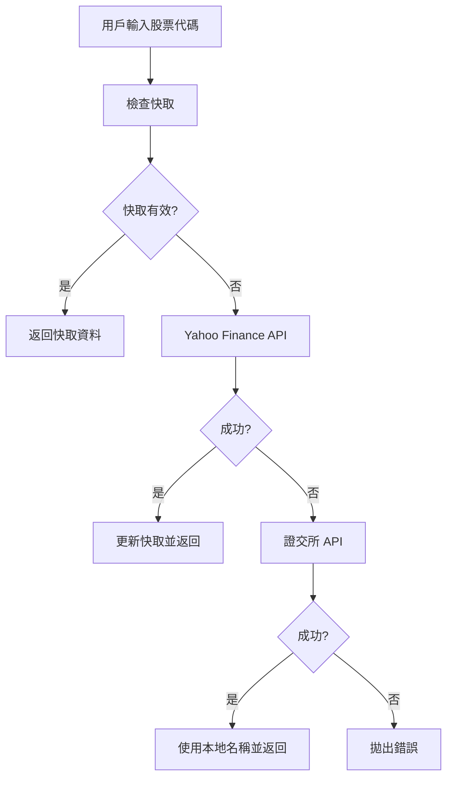
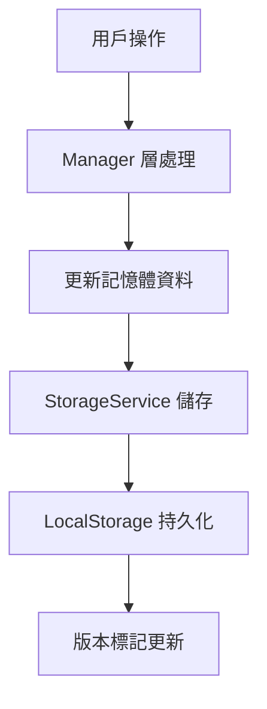

# 存股紀錄系統 v1.3.X 技術棧說明

## 📋 專案概述

存股紀錄系統是一個基於 TypeScript 的現代化 Web 應用程式，採用模組化架構設計，專為台股投資者提供完整的投資組合管理功能。

## 🛠️ 核心技術棧

### 前端技術
- **TypeScript 5.0+**: 提供型別安全和現代 JavaScript 功能
- **HTML5 + CSS3**: 響應式設計，支援深色/亮色模式
- **ES2022 模組**: 使用現代 JavaScript 模組系統
- **DOM API**: 原生 DOM 操作，無需額外框架

### 建置工具
- **Vite 5.0**: 現代化建置工具
  - 快速熱重載開發伺服器
  - TypeScript 編譯
  - 程式碼分割和最佳化
  - Source Map 支援
- **ESBuild**: 高效能程式碼壓縮
- **Rollup**: 模組打包和輸出最佳化

### 開發工具
- **ESLint**: 程式碼品質檢查
- **Prettier**: 程式碼格式化
- **Jest**: 單元測試框架
- **Fast-Check**: 屬性測試（Property-based Testing）

### 資料儲存
- **LocalStorage**: 瀏覽器本地儲存
- **版本隔離**: v1.3.X 與 v1.2.X 完全隔離
- **自動遷移**: 支援從舊版本自動遷移資料

### 外部 API 整合
- **證交所 API (TWSE/TPEx)**: 台股即時股價
- **Yahoo Finance API**: 國際股票和備援資料
- **CORS 代理**: 解決跨域請求問題

## 🏗️ 架構設計

### 模組化架構
```
src/
├── managers/          # 業務邏輯層
│   ├── StockManager.ts
│   ├── AccountManager.ts
│   ├── DividendManager.ts
│   └── PortfolioManager.ts
├── services/          # 服務層
│   ├── StockApiService.ts
│   ├── StorageService.ts
│   ├── MigrationService.ts
│   └── DataStorage.ts
├── types/            # 型別定義
│   ├── Stock.ts
│   ├── Account.ts
│   ├── Portfolio.ts
│   └── Errors.ts
├── utils/            # 工具函數
│   ├── formatters.ts
│   ├── validators.ts
│   └── calculators.ts
└── main.ts           # 應用程式入口
```

### 依賴注入模式
- Manager 層注入 Service 層
- Service 層處理外部依賴
- 清晰的職責分離

## 🌐 GitHub Pages 部署與股價查詢

### 部署配置

#### 1. 建置設定
```json
{
  "scripts": {
    "build": "tsc && vite build",
    "preview": "vite preview"
  }
}
```

#### 2. Vite 配置重點
```typescript
export default defineConfig({
  base: './',  // 相對路徑，適用於 GitHub Pages
  build: {
    outDir: 'dist',
    sourcemap: true,
    target: ['es2020', 'chrome80', 'firefox78', 'safari14']
  }
});
```

### 股價查詢實作

#### 1. API 查詢順序
```typescript
// 新增個股時的查詢順序
1. Yahoo Finance API (最高優先級)
2. 證交所 API (次優先級)
3. 拋出錯誤 (所有 API 都失敗)
```

#### 2. CORS 解決方案
```typescript
// 使用 CORS 代理服務
const corsProxy = 'https://api.allorigins.win/raw?url=';
const yahooUrl = `https://query1.finance.yahoo.com/v8/finance/chart/${symbol}`;
const finalUrl = corsProxy + encodeURIComponent(yahooUrl);
```

#### 3. 台股代碼格式化
```typescript
private formatTaiwanSymbol(code: string): string {
  // 台股代碼轉換為 Yahoo Finance 格式
  if (/^\d{4,6}$/.test(code)) {
    return `${code}.TW`;
  }
  return `${code}.TW`;
}
```

#### 4. 錯誤處理機制
```typescript
// 多層錯誤處理
try {
  // 嘗試 Yahoo Finance API
  const yahooInfo = await this.fetchStockInfoFromYahoo(code);
  return yahooInfo;
} catch (error) {
  // 嘗試證交所 API
  try {
    const twsePrice = await this.fetchFromTWSE(code);
    return { code, name: localName, price: twsePrice };
  } catch (twseError) {
    // 所有 API 都失敗
    throw new ApiError('無法取得股票資訊');
  }
}
```

### GitHub Pages 特殊考量

#### 1. 靜態檔案服務
- 所有資源使用相對路徑
- 支援 SPA 路由（如需要）
- 快取策略最佳化

#### 2. API 限制解決
- **CORS 問題**: 使用 `api.allorigins.win` 代理
- **請求頻率**: 實作快取機制（1分鐘 TTL）
- **錯誤重試**: 多個 API 來源備援

#### 3. 效能最佳化
```typescript
// 快取機制
private cache: Map<string, CachedPrice> = new Map();
private readonly CACHE_TTL = 60000; // 1 分鐘

// 批次處理
async updateAllPrices(): Promise<void> {
  const promises = Array.from(this.stocks.values()).map(
    stock => this.updateStockPrice(stock.code)
  );
  await Promise.allSettled(promises);
}
```

## 📊 資料流程

### 股價查詢流程


### 資料儲存流程


## 🔧 開發環境設定

### 必要環境
- **Node.js**: >=18.0.0
- **npm**: >=9.0.0

### 開發指令
```bash
# 安裝依賴
npm install

# 開發模式
npm run dev

# 建置生產版本
npm run build

# 預覽建置結果
npm run preview

# 執行測試
npm run test

# 程式碼檢查
npm run lint

# 格式化程式碼
npm run format
```

## 🚀 部署流程

### GitHub Pages 自動部署
1. 推送程式碼到 GitHub
2. GitHub Actions 自動建置
3. 部署到 GitHub Pages
4. 自動更新線上版本

### 手動部署
```bash
# 建置專案
npm run build

# 上傳 dist/ 目錄到 GitHub Pages
# 或使用 GitHub Actions 自動化
```

## 🔒 安全性考量

### API 安全
- 無敏感 API 金鑰暴露
- 使用公開 API 端點
- CORS 代理服務保護

### 資料安全
- 本地儲存加密（如需要）
- 版本隔離防止資料衝突
- 自動備份機制

## 📈 效能指標

### 建置效能
- **建置時間**: < 30 秒
- **檔案大小**: < 500KB (gzipped)
- **載入時間**: < 3 秒

### 執行效能
- **股價查詢**: < 2 秒
- **資料儲存**: < 100ms
- **介面響應**: < 16ms

## 🔮 未來規劃

### 技術升級
- PWA 支援
- Service Worker 快取
- WebAssembly 計算最佳化

### 功能擴展
- 雲端同步 (GitHub Gist)
- 更多股價資料來源
- 進階圖表分析

---

**版本**: v1.3.0.0012  
**更新日期**: 2025-01-02  
**作者**: 徐健倫  
**授權**: CC BY-NC 4.0